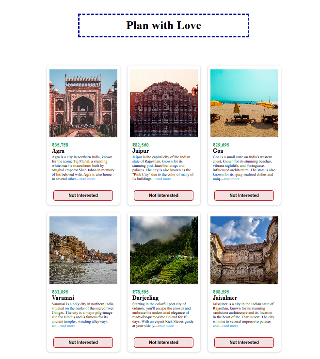

# Plan_with_love_UI

A responsive and interactive travel destination UI built using **React** and **CSS**. Users can view suggested destinations across India and choose to remove the ones they are not interested in by clicking the **"Not Interested"** button.

## ✨ Features

- 🖼️ Clean card layout with image, location, pricing, and description
- 👆 "Not Interested" button to dynamically remove a destination from the UI
- 🔄 Reusable component-based architecture
- 💻 Fully responsive design with modern CSS styling

---

## 📸 Preview

## 🔧 Tech Stack

- **React.js**
- **CSS3** (Custom Styling)
- **JavaScript (ES6+)**
